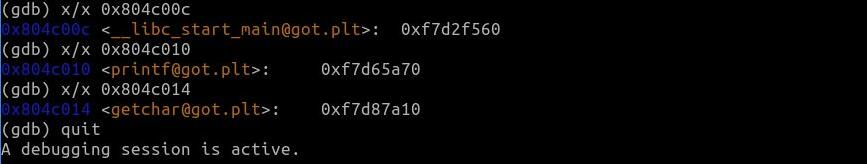
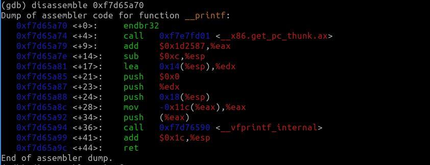

# RestoreGot
RestoreGot is a toy tool for restoring the Global Offset Table of 32-bit applications at runtime.

This program searches the .plt section by iterating through the section headers table of the elf.
Then it uses [ptrace](https://man7.org/linux/man-pages/man2/ptrace.2.html) to find the GOT entry of each PLT stub and to change its value back to the original
value which points back to the PLT stub (by that, the next call for each function in the PLT will result in calling `_dl_runtime_resolve` again
to resolve the "real" function's address).

Note: We do the above-mentioned for all of the PLT stubs except the first because the first PLT stub contains the code which calls `_dl_runtime_resolve` to resolve
the symbols in the PLT. 

## Demonstration

Executing the code of [example.c](Demonstration/example.c) prints the following line:
`Now 'printf' & 'getchar' addresses are resolved. Press ENTER key after running 'restore_got'...`. 
If we attach `gdb` to the running program we can see that the addresses of the symbols in the PLT 
are already resolved (because all of them were called until this point of the execution):\
\
and indeed if we look at the disassembly of the function in `0xf7d65a70` we see the code of
`printf`:\
\
then we can run the code of [restore_got.c](restore_got.c), and attaching again with `gdb` to view the GOT entries results in\
\
which are the original values. Indeed, pressing the ENTER key in the execution of [example.c](Demonstration/example.c) prints the following output:
`Now they are resolved again. Press ENTER key to exit...`. So `printf` was resolved again correctly.